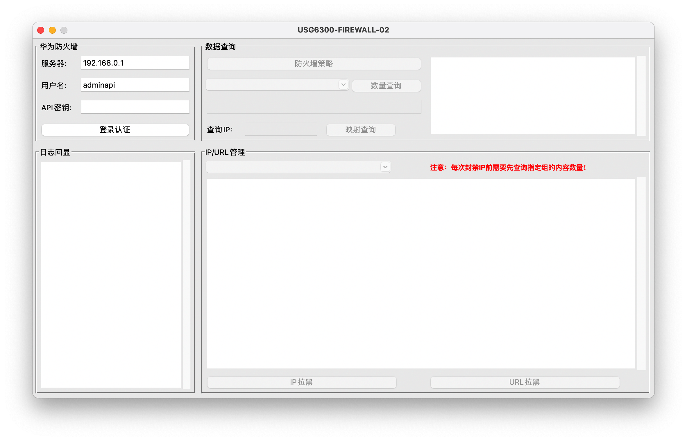

# NSD-GUI

NSD-GUI, The auxiliary tool for network security devices has now completed support for the Huawei USG6300 FIREWALL-02, with continuous updates planned for the future.

目前的版本主要应用于封禁IP和恶意域名等，配合华为防火墙USG6300 FIREWALL-02使用，大致功能点如下：

- 登陆和日志显示；
- 防火墙策略查询；
- 地址组和域名组内数量查询；
- 内网网IP映射查询；
- IP拉黑；
- URL拉黑。

